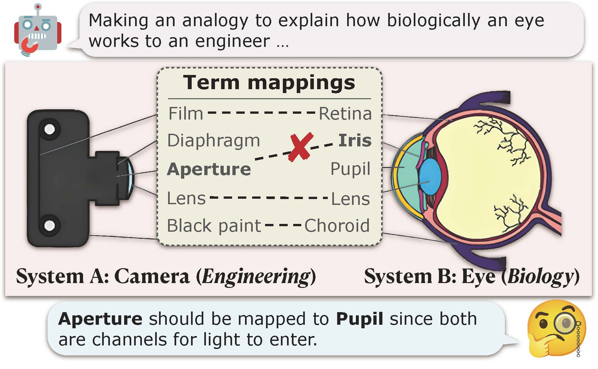

# SCAR



Resources for our EMNLP paper: *Beneath Surface Similarity: Large Language Models Make Reasonable Scientific Analogies after Structure Abduction*

## Dataset Format

Each data entry in the dataset is a JSON object containing the following fields:

- `id`: A unique integer identifier for the data sample
- `lang`: The language for the data
- `system_a`: System a in one system analogy
- `system_b`: System b in one system analogy
- `mappings`: The term mappins in one system analogy
- `system_a_domain`: The domain of the system a
- `system_b_domain`: The domain of the system b
- `system_a_background`: The background information of the system a
- `system_b_background`: The background information of the system b
- `Explanation`: The explanation for term mappings in one system analogy

### Example Data Entry

Here's an example data entry from the dataset:
```json
{
  "id": 55,
  "lang": "en",
  "system_a": "cell",
  "system_b": "factory",
  "mappings": [
    ["cell membrane","fence"],
    ["nucleus","headquarters"],
    ["cell organelle","machine"],
    ["metabolites","raw material"],
    ["molecular","manufactures"]
  ],
  "system_a_domain": "Biology",
  "system_b_domain": "Engineering"
  "system_a_background":"A cell is the fundamental and basic unit of life. It refers to a small and microscopic unit that possesses all the essential characteristics of life, such as the ability to respond to stimuli, reproduce, and process energy. The cell has three principal components: the cell membrane, nucleus, and cytoplasm with cell organelles. The cell membrane constitutes a thin boundary that encloses and protects the cell’s contents. The nucleus is a large organelle that controls the cell's activities and contains its genetic material. The cytoplasm is the fluid that fills the cell, and cell organelles are specialized subunits that carry out specific metabolic functions in the cell. Cells are involved in metabolism, which involves the breakdown and synthesis of metabolites, substances required for cell growth, and energy production. Molecular aspects of the cell include the proteins, lipids, and DNA that make up its structure and perform its essential functions.",
  "system_b_background":"A factory, also commonly known as a manufacturing or production plant, is a large industrial facility where workers operate machinery to manufacture items or process raw materials into other products. They are a significant component of modern economic production, responsible for creating and refining the majority of the world's goods. Factories have a complex structure consisting of multiple buildings filled with various machines and equipment for assembly line production. They may manufacture discrete products or continuously produced materials using heat or electricity to transform streams of raw materials. As a critical part of the production process, factories require large warehouses and transportation facilities for efficient operation. The term \"mill\" is often used to describe factories that manufacture specific goods, such as steel or paper. Factories may also have fences around them for security purposes and typically have headquarters located on site. Overall, factories play an essential role in economic production and are key players in the global manufacturing industry.",
  "Explanation":["The cell membrane corresponds to a fence: the cell membrane is the outer structure of the cell, playing a role in protecting and controlling the substances that enter and exit the cell; the fence of a factory is the outer structure of the factory, serving to protect and restrict access for personnel. In this analogy, both the cell membrane and the fence are boundaries and protective barriers for their respective systems.","The nucleus corresponds to headquarters: the nucleus is the center in the cell that controls gene expression and genetic information transfer; the headquarters of a factory is responsible for production planning and management. In this analogy, both the nucleus and the headquarters are the control and management centers of their respective systems.","Cell organelles correspond to machines: cell organelles are the structures responsible for performing specific functions in the cell; machines in a factory are responsible for performing various tasks in the production process. In this analogy, both cell organelles and machines are components that execute specific functions in their respective systems.","Metabolites correspond to raw materials: metabolites in the cell are substances involved in biochemical reactions, such as proteins, fats, and carbohydrates; raw materials in a factory are used for producing finished products. In this analogy, both metabolites and raw materials are substances that are necessary for production and reaction in their respective systems.","Molecules correspond to finished products: molecules such as ATP, produced by the cell through metabolic processes, are the energy source of the cell; finished products produced by a factory are the final products that can be sold and used. In this analogy, both molecules and finished products are the products of their respective systems."]
}
```

## Ethics Statement
All authors of this work abide by the provided Code of Ethics. Annotators recruited by our institution annotate the system analogies in SCAR. The annotation quality is ensured through a double-check strategy. We ensure that the privacy rights of all annotators are respected in the annotation process. As described in our paper, all annotators are compensated above the local minimum wage and consent to using the SCAR for research purposes.


## Citation

If you find our paper or resources useful, please kindly cite our paper. If you have any questions, please [contact us](mailto:syyuan21@m.fudan.edu.cn)!

```latex
@inproceedings{yuan-etal-2023-beneath,
    title = "Beneath Surface Similarity: Large Language Models Make Reasonable Scientific Analogies after Structure Abduction",
    author = "Yuan, Siyu  and
      Chen, Jiangjie  and
      Ge, Xuyang  and
      Xiao, Yanghua  and
      Yang, Deqing",
    editor = "Bouamor, Houda  and
      Pino, Juan  and
      Bali, Kalika",
    booktitle = "Findings of the Association for Computational Linguistics: EMNLP 2023",
    month = dec,
    year = "2023",
    address = "Singapore",
    publisher = "Association for Computational Linguistics",
    url = "https://aclanthology.org/2023.findings-emnlp.160",
    doi = "10.18653/v1/2023.findings-emnlp.160",
    pages = "2446--2460",
    abstract = "The vital role of analogical reasoning in human cognition allows us to grasp novel concepts by linking them with familiar ones through shared relational structures. Despite the attention previous research has given to word analogies, this work suggests that Large Language Models (LLMs) often overlook the structures that underpin these analogies, raising questions about the efficacy of word analogies as a measure of analogical reasoning skills akin to human cognition. In response to this, our paper introduces a task of analogical structure abduction, grounded in cognitive psychology, designed to abduce structures that form an analogy between two systems. In support of this task, we establish a benchmark called SCAR, containing 400 scientific analogies from 13 distinct fields, tailored for evaluating analogical reasoning with structure abduction. The empirical evidence underlines the continued challenges faced by LLMs, including ChatGPT and GPT-4, in mastering this task, signifying the need for future exploration to enhance their abilities.",
}
```
