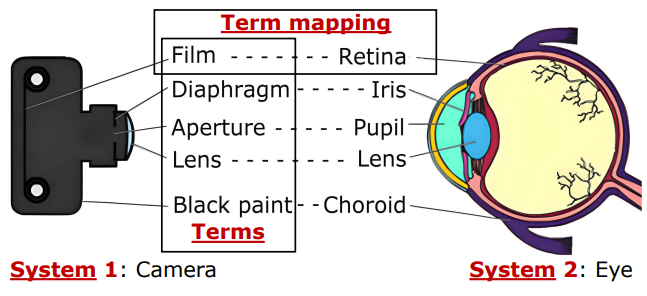

# SA2

Resources for the paper: *Lifting the Veil of Analogy: Scientific Analogical Structure Abduction for Large Language Models*

## Dataset Format

Each data entry in the dataset is a JSON object containing the following fields:

- `id`: A unique integer identifier for the data sample
- `lang`: The language for the data
- `system_1`: System 1 in one system analogy
- `system_2`: System 2 in one system analogy
- `system_1_domain`: The domain of the system 1
- `system_2_domain`: The domain of the system 2
- `system_1_background`: The background information of the system 1
- `system_2_background`: The background information of the system 2
- `Explanation`: The explanation for term mappings in one system analogy

## Ethics Statement
All authors of this work abide by the provided Code of Ethics. Annotators recruited by our institution annotate the system analogies in SA2. The annotation quality is ensured through a double-check strategy. We ensure that the privacy rights of all annotators are respected in the annotation process. As described in our paper, all annotators are compensated above the local minimum wage and consent to using the SA2 for research purposes.
